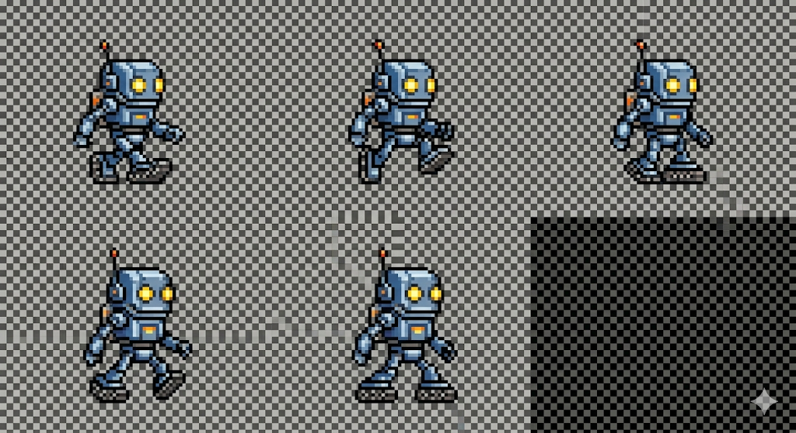
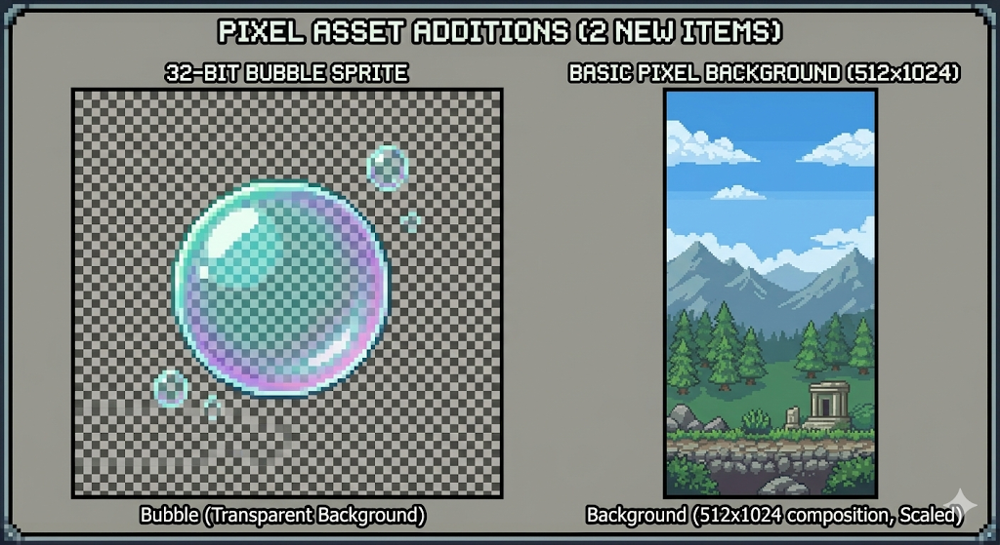
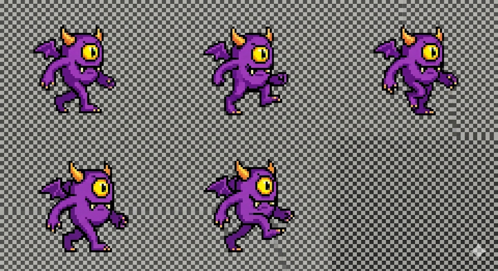

# AI tools used:
## Google Gemini & Banana Pro
### Chat Link:  https://gemini.google.com/share/cd0ccc41fa4c
### My prompts:
#### Can you please make a walk cycle for a basic 32 bit monster? I need 5 images for a complete walk cycle and the images need to have a transparent background

#### Thank you! Can i also get another 32 bit walk cycle but this time its for a small robot? Ill need 5 frames as well and a transparent background

#### Thank you! Can i please also get a small tile map with 6 different tiles that are 32 bit each? I need one of them to be a grass block, and another to be a brick tile, the rest can be anything

#### Okay, i need two more small things, i need a 32 bit bubble art with a transparent background, and i also need a basic pixel background art background that is 512 x 1024 

#### Can you modify the first image you made, the one with the monster walk cycle, so that it is 5 separate images that are png, with no background?

## Conclusion

#### AI tools are not ready for real use. All of the work it gave
me i had to edit myself and the physical quality of the art
i was not impressed with. It was unable to make anything with a 
transparent background, even after i corrected it and told them to redo
it again.